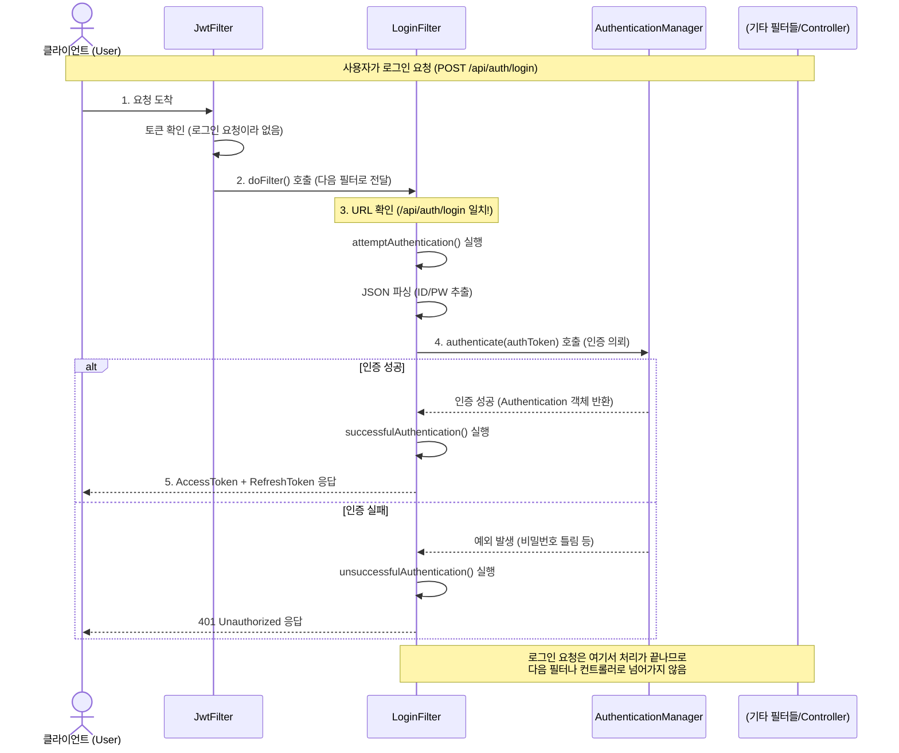
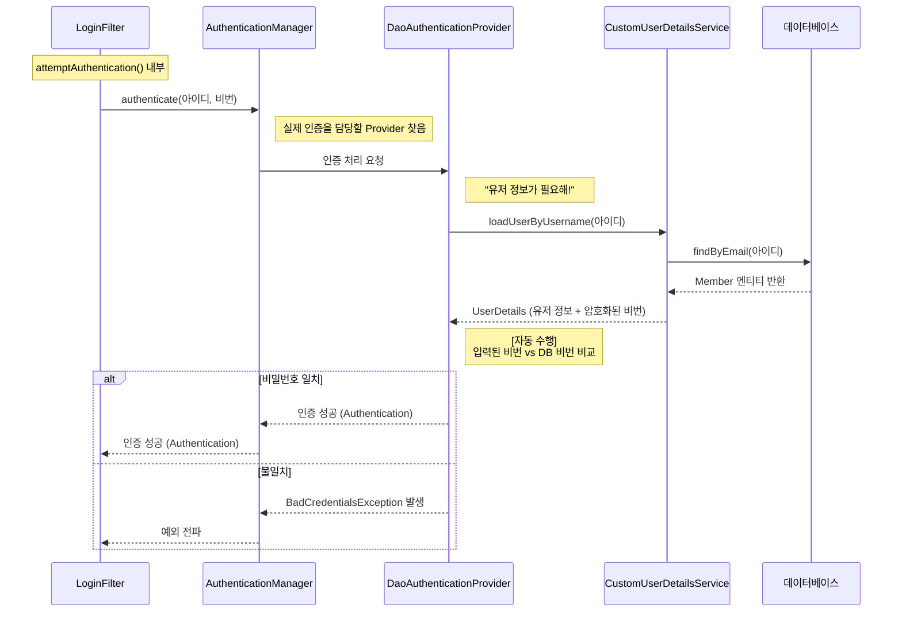

# 인증 필터 및 로그인 프로세스 시퀀스 다이어그램

이 문서는 MeeTeam 백엔드의 인증 처리 과정, 특히 필터 간의 흐름과 로그인 시 내부 동작 원리를 시각적으로 설명합니다.

## 1. 전체 필터 체인 흐름 (로그인 요청 시)

사용자가 `POST /api/auth/login` 요청을 보냈을 때, 요청이 어떤 필터들을 거쳐서 처리되는지 보여줍니다.

---

## 2. 로그인 상세 프로세스 (내부 동작)

`LoginFilter`가 `AuthenticationManager`에게 인증을 의뢰했을 때, 내부적으로 DB 조회가 어떻게 일어나는지 보여줍니다.

## 요약

1.  **JwtFilter**: 모든 요청의 문지기. 로그인 요청은 그냥 통과시킵니다.
2.  **LoginFilter**: `/api/auth/login` 요청만 낚아채서 처리합니다.
3.  **AuthenticationManager**: 인증 총괄 매니저입니다. 실제 일은 `Provider`에게 시킵니다.
4.  **CustomUserDetailsService**: 우리가 직접 구현한 부분입니다. **DB에서 유저 정보를 꺼내오는 역할**만 합니다.
5.  **비밀번호 검증**: Spring Security가 내부적으로 알아서 수행하므로 우리가 코드를 짤 필요가 없습니다.
