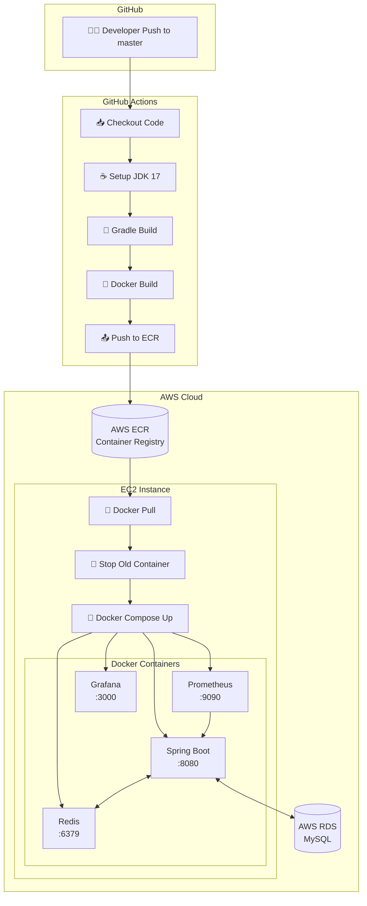

# MeeTeam Backend 배포 파이프라인

## 개요

MeeTeam Backend는 **GitHub Actions + AWS ECR + Docker Compose + EC2** 기반의 CI/CD 파이프라인을 사용합니다.

---

## 파이프라인 아키텍처

### 전체 흐름도

```
┌─────────────────────────────────────────────────────────────────────────────────┐
│                              GitHub Actions (CI/CD)                              │
├─────────────────────────────────────────────────────────────────────────────────┤
│                                                                                  │
│   ┌──────────┐    ┌──────────┐    ┌──────────┐    ┌──────────┐    ┌──────────┐  │
│   │ Checkout │───▶│ JDK 17   │───▶│  Gradle  │───▶│  Docker  │───▶│   ECR    │  │
│   │   Code   │    │  Setup   │    │  Build   │    │  Build   │    │   Push   │  │
│   └──────────┘    └──────────┘    └──────────┘    └──────────┘    └────┬─────┘  │
│                                                                        │        │
└────────────────────────────────────────────────────────────────────────┼────────┘
                                                                         │
                                                                         ▼
┌─────────────────────────────────────────────────────────────────────────────────┐
│                                  AWS Cloud                                       │
│  ┌─────────────────┐                                                            │
│  │   AWS ECR       │◀─── Docker Image (meeteam-server:latest)                   │
│  │  (Container     │                                                            │
│  │   Registry)     │                                                            │
│  └────────┬────────┘                                                            │
│           │                                                                      │
│           │ docker pull                                                          │
│           ▼                                                                      │
│  ┌─────────────────────────────────────────────────────────────────┐            │
│  │                        EC2 Instance                              │            │
│  │  ┌─────────────────────────────────────────────────────────┐    │            │
│  │  │                    Docker Compose                        │    │            │
│  │  │  ┌──────────────┐  ┌───────┐  ┌────────────┐  ┌───────┐ │    │            │
│  │  │  │ meeteam-     │  │ Redis │  │ Prometheus │  │Grafana│ │    │            │
│  │  │  │ server:8080  │  │ :6379 │  │   :9090    │  │ :3000 │ │    │            │
│  │  │  └──────────────┘  └───────┘  └────────────┘  └───────┘ │    │            │
│  │  └─────────────────────────────────────────────────────────┘    │            │
│  └─────────────────────────────────────────────────────────────────┘            │
│                                                                                  │
│  ┌─────────────────┐                                                            │
│  │   AWS RDS       │◀─── MySQL 8.0 (meeteam-db)                                 │
│  │   (Database)    │                                                            │
│  └─────────────────┘                                                            │
└─────────────────────────────────────────────────────────────────────────────────┘
```

### Mermaid 다이어그램



---

## 파이프라인 상세 단계

### 1단계: CI (Continuous Integration)

| 순서 | 단계 | 설명 |
|:---:|------|------|
| 1 | **Checkout** | GitHub 저장소에서 코드 체크아웃 |
| 2 | **JDK Setup** | Temurin JDK 17 설치 |
| 3 | **Gradle Build** | `./gradlew clean build -x test` 실행 |
| 4 | **Docker Build** | Dockerfile 기반 이미지 생성 |
| 5 | **ECR Push** | AWS ECR에 이미지 업로드 |

### 2단계: CD (Continuous Deployment)

| 순서 | 단계 | 설명 |
|:---:|------|------|
| 6 | **SSH Connect** | EC2 인스턴스에 SSH 접속 |
| 7 | **ECR Login** | EC2에서 ECR 인증 |
| 8 | **Stop Container** | 기존 컨테이너 중지 및 삭제 |
| 9 | **Pull Image** | 새 이미지 다운로드 |
| 10 | **Start Container** | Docker Compose로 서비스 시작 |

---

## 트리거 조건

```yaml
on:
  push:
    branches:
      - master
```

- **master** 브랜치에 Push 시 자동 실행

---

## 인프라 구성

### AWS 리소스

| 리소스 | 용도 | 리전 |
|--------|------|------|
| **ECR** | Docker 이미지 저장소 | ap-northeast-2 |
| **EC2** | 애플리케이션 서버 | ap-northeast-2 |
| **RDS** | MySQL 데이터베이스 | ap-northeast-2 |

### Docker Compose 서비스

| 서비스 | 이미지 | 포트 | 역할 |
|--------|--------|------|------|
| `meeteam-server` | ECR 이미지 | 8080 | Spring Boot API |
| `redis` | redis:7 | 6379 | 캐시/세션 |
| `prometheus` | prom/prometheus | 9090 | 메트릭 수집 |
| `grafana` | grafana/grafana | 3000 | 모니터링 대시보드 |

---

## GitHub Secrets

| Secret | 용도 |
|--------|------|
| `AWS_ACCESS_KEY_ID` | AWS 인증 |
| `AWS_SECRET_ACCESS_KEY` | AWS 인증 |
| `EC2_HOST` | EC2 IP 주소 |
| `EC2_USERNAME` | EC2 SSH 사용자 |
| `EC2_PRIVATE_KEY` | EC2 SSH 키 |

---

## Dockerfile

```dockerfile
FROM eclipse-temurin:17-jdk-alpine
COPY ./build/libs/*SNAPSHOT.jar app.jar
ENTRYPOINT ["java", "-jar", "app.jar"]
```

---

## 배포 스크립트 (EC2)

```bash
cd /home/ubuntu/meeteam
echo $ECR_PASSWORD | docker login --username AWS --password-stdin $ECR_REGISTRY
docker stop meeteam-server || true
docker rm meeteam-server || true
docker compose pull meeteam-server
docker compose up -d meeteam-server
```

---

## 현재 파이프라인의 특징

### 장점

- GitHub Actions 무료 사용 (퍼블릭 저장소)
- ECR로 이미지 중앙 관리
- Docker Compose로 간편한 인프라 구성
- Prometheus/Grafana 모니터링 내장

### 개선 필요 사항

| 항목 | 현재 | 권장 |
|------|------|------|
| 테스트 | `-x test` (스킵) | 테스트 실행 필수 |
| 배포 방식 | Rolling (다운타임 有) | Blue-Green 배포 |
| 롤백 | 수동 | 자동 롤백 메커니즘 |
| 헬스체크 | 없음 | `/actuator/health` 확인 |
| DDL 관리 | `create` | `validate` + Flyway |

---

## 참고

- 워크플로우 파일: `.github/workflows/deploy.yml`
- Docker Compose 파일: `compose.yml`
- 프로덕션 설정: `src/main/resources/application-prod.yml`
